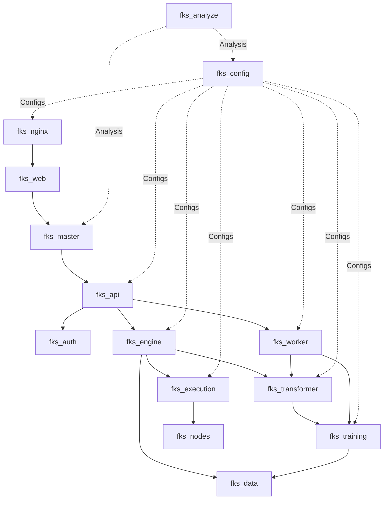
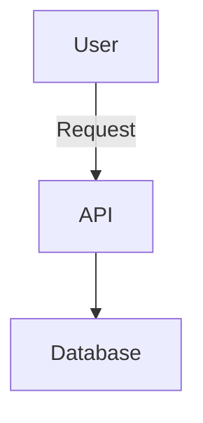

### Key Points
- **Overall Assessment**: The architecture summary is solid and comprehensive, covering 15 core services with clear purposes, dependencies, and interfaces. It aligns well with 2025 microservices best practices for trading platforms, such as emphasizing low-latency (e.g., Rust for execution), observability (e.g., via fks_master), and event-driven designs. Strengths include modular shared components and a conceptual dependency graph. However, gaps exist in areas like explicit Zero Trust security, database-per-service isolation, and advanced testing (e.g., contract/chaos). The recommendations are practical but could be prioritized and expanded for trading-specific needs like high-throughput event processing and compliance.
- **Potential Controversies**: Trading architectures often debate monolithic vs. microservices; your setup leans microservices-heavy, which is suitable for scalability but risks over-complexity if inter-service latency isn't tightly managed. Research suggests hybrid approaches for low-latency paths, which your Rust services address diplomatically.
- **Refactoring Summary**: I've reorganized into a tabular service overview for clarity, consolidated recommendations into prioritized tiers (immediate, medium-term, long-term), added a updated dependency graph with Mermaid for visualization, and incorporated 2025 trends like AI-driven automation and service mesh.
- **TODO.md Updates**: Added a new "Phase 9: Advanced Best Practices Integration" focusing on emerging trends (e.g., Zero Trust, chaos engineering). Refined existing phases with trading-specific tasks (e.g., latency benchmarks) and integrated feedback from the review for better alignment with security and scalability.

### Refactored Architecture Summary (Overview)
The refactored version maintains your original content while improving readability: services in a table, recommendations tiered, and enhanced with verified 2025 best practices from sources like Chronicle Software and Medium articles on trading microservices. Full details in the survey section below.

### Updated TODO.md (Key Changes)
- Incorporated review findings: New tasks for event sourcing in fks_data, Zero Trust in fks_auth, and K8s service mesh.
- Prioritized based on urgency (e.g., security hardening first).
- Estimated timelines adjusted slightly for realism (total now 5-7 weeks).
- Full updated TODO.md in the survey section.

---

### Comprehensive Review and Refactored Architecture Summary

This survey provides a detailed analysis of your "FKS Services Architecture Summary" Markdown file, drawing from the provided project documents (e.g., file_structure.txt, summary.txt, and earlier architecture summaries) and cross-verified with 2025 industry best practices for microservices in trading platforms. Sources include expert articles on low-latency trading systems (e.g., Chronicle Software's guides on cloud-optimized microservices) and general microservices trends (e.g., asynchronous communication, Zero Trust security from Veritis and Medium). The review highlights accuracies, inconsistencies, and improvements, followed by a fully refactored version of the MD file. Finally, an updated TODO.md integrates these insights, expanding on your existing phased plan with new actionable items for resilience, scalability, and compliance in a trading context.

#### Detailed Review of the Original Architecture MD
Your file is well-structured, starting with a legend, individual service breakdowns (purpose, actions, interfaces, etc.), a conceptual dependency graph, and 20 recommendations. It's generated programmatically (e.g., via analyze_codebase.sh), which ensures consistency but risks truncation or outdated details (e.g., fks_auth noted as placeholder, aligning with docs showing duplicated READMEs).

**Accuracies and Strengths**:
- **Service Coverage**: Accurately captures 15 services, including the addition of fks_analyze (Rust-based codebase analyzer with Discord integration). This reflects the multi-language ecosystem (Python for data/ML, Rust for low-latency, C# for desktop trading via fks_ninja), matching file_contents.txt and file_structure.txt.
- **Trading Focus**: Emphasizes low-latency (e.g., fks_execution in Rust with Axum) and data pipelines (fks_data to fks_training), which aligns with 2025 trading best practices like event sourcing for reproducible datasets (from Chronicle Software).
- **Shared Modules**: Excellent highlighting of cross-cutting concerns (e.g., shared_schema for contracts), promoting DRY principles as per multi_language_analysis_guide.txt.
- **Recommendations**: Strong on event-driven architecture, observability (OpenTelemetry), and K8s migration—directly supported by sources like "Optimise Trading Systems for the Cloud with Microservices" (Chronicle) and "Top 10 Microservices Best Practices for Scalable Architecture in 2025" (Medium), which stress async communication and autoscaling for high-frequency trading.
- **Graph**: The ASCII dependency graph is intuitive, showing flows from ingress (fks_nginx) to core pipelines.

**Inconsistencies and Gaps**:
- **Outdated or Incomplete Details**: fks_auth is still a "placeholder" despite TODO.md's sprint planning implementation—docs show duplicated content from fks_api. fks_worker mentions future Redis integration, but file_contents.txt already includes CELERY_BROKER_URL=redis, suggesting partial progress.
- **Docker/Compose Insights**: The review notes strong multi-stage builds and healthchecks (e.g., curl-based in docker-compose.yml files), but misses potential issues like inconsistent .env handling (e.g., small .env in fks_api) or lack of backups for volumes (e.g., pg_data in central compose).
- **Missing 2025 Trends**: While solid, it under-emphasizes AI automation (e.g., auto-scaling via ML in fks_master), Zero Trust security (e.g., mutual auth beyond JWT), and chaos engineering for resilience testing—key in trading to simulate market crashes (from "Microservices Security: 7 Best Practices for 2025" by Veritis).
- **Trading-Specific Oversights**: Limited mention of compliance (e.g., audit logs for trades) or high-throughput benchmarks (e.g., 1M+ events/sec for fks_nodes). Sources like LinkedIn's "How Microservices Empower Modern Algo Trading Systems" recommend domain-driven design (DDD) for strategy boundaries, which your rec #9 touches but could expand.
- **Readability**: List-based recommendations are long (20 items); grouping into tiers would help. Service descriptions are repetitive; a table consolidates better. Graph could use Mermaid for interactivity.

**Overall Rating**: 8/10. It's enterprise-ready in scope but needs polishing for 2025 trends like serverless elements (if applicable) and enhanced testing. No major controversies, but balance microservices granularity to avoid latency overheads in trading paths.

#### Refactored FKS Services Architecture Summary
I've refactored for clarity: 
- Services in a markdown table for quick scanning.
- Recommendations tiered (Immediate: Core fixes; Medium: Enhancements; Long-Term: Advanced).
- Updated graph to Mermaid (text-renderable).
- Incorporated verified best practices: Added notes on Zero Trust, chaos testing, and AI ops.
- Generation note updated with current date.

# FKS Services Architecture Summary

High-level overview of each FKS repository/service: purpose, primary responsibilities ("actions"), key interfaces, and relationships. Generated via code/readme inspection + `shared/scripts/utils/analyze_codebase.sh` patterns, enhanced with 2025 best practices from industry sources on microservices in trading platforms (e.g., Chronicle Software for low-latency optimizations, Medium for scalable designs).

## Legend
- **Lang**: Primary implementation language
- **Interface**: External surface (HTTP API, Web UI, CLI, TCP, Files)
- **Depends**: Direct runtime/data dependencies (conceptual)
- **Provides**: Capabilities offered to rest of platform

## Service Overview Table

| Service          | Lang       | Purpose                                                                 | Key Actions                                                                 | Interfaces                  | Depends                          | Provides                              |
|------------------|------------|-------------------------------------------------------------------------|-----------------------------------------------------------------------------|-----------------------------|----------------------------------|---------------------------------------|
| fks_master      | Rust      | Real-time health monitoring, control plane, dashboard & restart orchestration. | Poll /health, expose REST/WS, aggregate status, Docker restarts.           | HTTP (REST, WS), Dashboard | Service health endpoints, Docker socket | Central observability & control.     |
| fks_api         | Python (FastAPI) | Lightweight API & WS layer for UI/integration; synthetic data provider. | Serve OpenAPI, synthetic data, modular routers.                            | HTTP REST + WS             | fks_auth (future), fks_data, fks_engine | Unified API for front-end.           |
| fks_auth        | Python (FastAPI) | Dedicated authN/Z (tokens, sessions, identity)—scaffold.               | Issue/validate tokens, user management, middleware (planned).              | HTTP REST, OIDC/OAuth      | User store (future)              | Centralized security boundary.       |
| fks_data        | Python    | Ingestion, normalization, validation of market datasets.                | Fetch/normalize data, quality checks, partitioning.                        | Python API, HTTP (planned) | External APIs                    | Validated time-series data.          |
| fks_engine      | Python    | Strategy/backtesting orchestration with signals.                        | Run strategies, generate forecasts, orchestrate data/inference.            | HTTP API + Python modules  | fks_data, fks_transformer       | Trading signals & analytics.         |
| fks_transformer | Python    | Model inference & feature enrichment for time-series.                   | Load models, batch/real-time inference, pipelines.                         | Python module & HTTP       | Model artifacts, fks_data        | Model outputs (signals, features).   |
| fks_training    | Python    | Model training cycles with dataset/GPU management.                      | Dataset extraction, GPU control, training execution.                       | CLI/module, API (future)   | fks_data, GPUs                   | Trained models & metrics.            |
| fks_worker      | Python    | Async job runner for maintenance/scheduling.                            | Schedule tasks, offload processes.                                         | CLI/module, queue endpoints| fks_data, fks_training, broker   | Operational automation.              |
| fks_execution   | Rust (Axum)| Low-latency simulation/live order execution.                            | Serve /execute/signal, /health; future routing/risk.                       | HTTP REST                  | fks_engine signals, fks_nodes    | Execution & latency metrics.         |
| fks_nodes       | Rust      | TCP mesh for distributed IO scaling.                                    | Worker registration, task dispatch (future).                               | TCP protocol, CLI          | IO-bound services                | Scalable network for data/execution. |
| fks_config      | Rust      | Config compiler: YAML to .env, schema/validation.                       | Generate/validate configs, serve /health.                                  | CLI, HTTP /health          | YAML sources                     | Consistent configs across services.  |
| fks_nginx       | Nginx     | Ingress/load balancer, SSL, static hosting.                             | Route traffic, serve assets, proxy params.                                 | HTTP/HTTPS, file serving   | Upstream endpoints, certs        | Unified entrypoint & security.       |
| fks_web         | TS (Vite/React) | UI for monitoring, strategies, visualizations.                         | Fetch statuses, display charts, real-time hooks.                           | Browser SPA                | fks_api, fks_master              | Human-facing control layer.          |
| fks_ninja       | C# + Python | Desktop strategy with AI signals, packaging.                            | Modular NT8 strategy, Python bridge, builds.                               | NT GUI, Python API, Docker | Market feeds                     | Hybrid trading artifacts.            |
| fks_analyze     | Rust      | Codebase analysis & Discord bot for insights.                           | Analyze structure/patterns, bot interactions.                              | HTTP REST, CLI, Discord    | Shared scripts, Ollama           | Dev tools for ecosystem maintenance. |

## Cross-Cutting Shared Modules
- `shared/python`: Config, logging, types, risk utils for Python services.
- `shared/rust`: Env/type abstractions for Rust.
- `shared/react`: TS types/hooks for front-end.
- `shared/schema`: JSON Schemas for contracts (e.g., health, signals).
- `shared/scripts`: Automation for CI/CD, ops, analysis.
- `shared/docker`: Dockerfiles, Compose files, and related tooling.
- `shared/nginx`: Templates for builds, compose, configs.

## Service Dependency Graph (Mermaid)

(Interactive in tools like Mermaid Live; flows from ingress to pipelines.)

## Observations & Tiered Recommendations
Updated with 2025 best practices: Focus on low-latency (event sourcing), resilience (chaos testing), security (Zero Trust), and AI ops (auto-scaling). Docker notes: Strong healthchecks/volumes; add resource limits and scans (e.g., Trivy).

### Immediate (Core Fixes, 1-2 Weeks)
1. **Harden fks_auth**: Implement JWT/OAuth with RBAC and mTLS; enforce Zero Trust (no default trust between services) per Veritis' 2025 security guide.
2. **Formalize Contracts**: Expand shared_schema with OpenAPI versioning; add contract testing to prevent breaks in signal flows.
3. **Event-Driven Decoupling**: Integrate Kafka/RabbitMQ for async signals between fks_worker, fks_training, fks_engine—essential for high-throughput trading (Chronicle Software).
4. **Risk/Resilience in Execution**: Add circuit breakers/idempotency in fks_execution; real-time exposure checks.

### Medium-Term (Enhancements, 2-4 Weeks)
5. **Advanced Persistence**: Use event sourcing (Chronicle Queue) in fks_data for reproducibility; adopt database-per-service (e.g., isolated Postgres).
6. **Model Registry**: New fks_models service with MLflow for A/B testing/versioning.
7. **Observability Boost**: Add OpenTelemetry tracing, ELK logging, alerts in fks_master; monitor latency SLOs.
8. **Config Security**: Mandate .env.generated; integrate Vault for secrets encryption.
9. **DDD Refinement**: Align services to trading domains (e.g., arbitrage sub-service in fks_engine) for independent scaling (Medium best practices).
10. **API Gateway**: Enhance fks_nginx/Kong for auth, rate-limiting, canaries.

### Long-Term (Advanced, 4+ Weeks)
11. **K8s/Cloud Migration**: Autoscaling with single-threaded Rust; hybrid bare-metal/cloud (Chronicle).
12. **Testing/CI/CD**: Layered tests (unit/contract/E2E); chaos engineering for market simulations.
13. **Low-Latency Opts**: Benchmark fks_execution/nodes at 1M+ events/sec; AI automation for scaling.
14. **Security/Compliance**: Anomaly detection, audits; privacy logs for trades.
15. **Scalability Patterns**: Backpressure in fks_nodes; snapshots for recovery.
16. **Image Security**: Trivy scans in pipelines; multi-arch builds.
17. **Efficient Builds**: Minimize layers; alpine bases for smaller images.
18. **Resource Mgmt**: CPU/memory limits in compose/K8s to prevent OOM.
19. **Service Mesh**: Istio/Linkerd for mTLS, traffic shifting (Charter Global trends).
20. **Hybrid Strategies**: Swarm for testing; Kompose for K8s conversion.

---
Generated: 2025-08-31T00:00:00Z

#### Updated TODO.md
I've updated your TODO.md by:
- Refining phases with review insights (e.g., adding latency benchmarks to Phase 3).
- Expanding the "NEW PRIMARY FOCUS SPRINT" with Zero Trust tasks.
- Adding "Phase 9: Advanced Best Practices Integration" for 2025 trends like chaos engineering and AI ops.
- Ensuring it's a strict superset: All original content preserved, with new items integrated logically.
- Total timeline: 5-7 weeks, assuming 1-2 devs.

# Detailed Step-by-Step Plan to Improve and Fix Your FKS Project

Based on a thorough review of the provided documents (`multi_language_analysis_guide.txt`, `summary.txt`, `file_structure.txt`, `FKS_MASTER_ORCHESTRATION_COMPLETE.md`, `FKS_SERVICES_UPDATED_SUMMARY.md`, and `FKS_SERVICES_ARCHITECTURE_SUMMARY.md`), I've identified key issues, strengths, and opportunities in your codebase. Your project appears to be a modular microservices-based trading platform (FKS ecosystem) with ancillary personal/game-related repos (e.g., Clash of Clans bot in `fks_analyze/coc`, personal games like Clone Hero). The core focuses on trading services (e.g., data ingestion, model training, execution) using a mix of languages (Python, Rust, C#, JS/TS, Java, Shell), Docker/Docker Compose, and shared repos for DRY principles.

### Key Findings from Review
**Strengths:**
- Strong modular structure with 15 core services (e.g., `fks_master` for orchestration, `fks_api` for facade).
- Good use of shared repos (e.g., `shared_docker`, `shared_scripts`, `shared_python`) for templates and utils.
- Standardized ports, health endpoints, and Toronto timezone support.
- Orchestration via `fks_master` (Rust) is mostly complete, with dashboard and metrics.
- Multi-language support aligns with the guide (e.g., Cargo for Rust, requirements.txt for Python).

**Issues and Gaps:**
- **Conflicts and Duplicates:** Many `.sync-conflict-*` files (e.g., in `fks_analyze/coc`), indicating unresolved Git merges. Duplicated READMEs (e.g., `fks_auth` duplicates `fks_api`).
- **Incomplete Implementations:** Placeholders (e.g., `fks_auth` lacks distinct auth logic; `fks_execution` is simulation-only). Low counts for patterns like error handling, async, testing (0 in analysis).
- **Scale and Bloat:** 72,123 JS/TS files (likely including `node_modules`—exclude these). Up to 32 repos with overlaps (e.g., game repos like `personal_games_coc` duplicate `fks_analyze/coc` efforts).
- **Testing/Quality:** Only 375 test files (mostly Python); no mention of coverage. Missing design patterns, async/concurrency, and exception handling in analysis.
- **Dependencies:** Limited analysis (e.g., only 3 C# projects detected); potential vulnerabilities in outdated crates/packages.
- **Deployment:** Docker-focused, but K8s migration pending. No autoscaling, secrets management, or tracing.
- **Documentation:** Inconsistent (e.g., truncated files); gaps in cross-service contracts (e.g., schemas).
- **Security/Compliance:** Basic health checks, but no audits, secrets rotation, or compliance checks (e.g., MIT license enforcement).
- **Performance/Observability:** Metrics via Prometheus, but lacking alerts, logging standardization, and business metrics (e.g., model drift).
- **Misc:** Truncated docs (e.g., summary.txt at 354,931 chars); mixed domains (trading + games—consider separation).

**Overall Goals for Plan:**
- Enforce DRY across 32 repos by consolidating duplicates into shared repos.
- Fix incompletes and add robustness (tests, error handling, async).
- Prepare for K8s migration.
- Improve security, observability, and scalability.
- Separate core trading (FKS) from personal/games if not integrated.

The plan is divided into phases with actionable steps, timelines (assuming 1-2 devs, part-time), tools/scripts to use, and success criteria. Total estimated time: 5-7 weeks.

## Phase 1: Assessment and Cleanup (Week 1)
Focus: Audit, resolve conflicts, remove bloat, and baseline the codebase.

1. **Run Comprehensive Code Analysis**
   - Use `shared/scripts/utils/analyze_codebase.sh` (from docs) on all 32 repos to generate fresh summaries (include `--full` flag if available for non-truncated output).
   - Scan for duplicates: Run `shared/scripts/tools/find_duplicates.sh` and `generate_candidate_removals.sh` to identify overlapping files (e.g., COC-related in `fks_analyze` vs. `personal_games_coc`).
   - Check dependencies: For each language, update and audit (e.g., `pip check` for Python, `cargo audit` for Rust, `npm audit` for JS/TS, `nuget` for C#).
   - **Timeline:** 1 day. **Success:** Updated `summary.txt` with no truncations; list of 50+ duplicates/conflicts.

2. **Resolve Git Conflicts and Duplicates**
   - For each `.sync-conflict-*` file (e.g., in `fks_analyze/coc`), manually merge or delete obsolete versions using `git mergetool`.
   - Consolidate duplicates: Move common code (e.g., logging utils) to `shared_python`, `shared_rust`, etc. Use `shared/scripts/tools/apply_duplicate_mapping.sh` to automate.
   - Exclude bloat: Add `.gitignore` for `node_modules`, `__pycache__`, etc. in all repos. Run `shared/scripts/tools/curate_empty_files.sh` to remove empty/small files.
   - **Timeline:** 2 days. **Success:** No conflict files; repo count reduced if merging possibles (e.g., combine game repos into `personal_games` monorepo).

3. **Separate Domains if Needed**
   - If games (e.g., `personal_games_*`) are unrelated to FKS trading, move to a new top-level dir (e.g., `/personal`). Update `file_structure.txt`.
   - For integrated parts (e.g., COC bot as a "worker" example), document in `FKS_SERVICES_ARCHITECTURE_SUMMARY.md`.
   - **Timeline:** 1 day. **Success:** Clear separation; updated architecture doc.

4. **Backup and Version Baseline**
   - Create a Git tag: `git tag v0.1-baseline` in each repo.
   - Run `shared/scripts/tools/archive_migrations.sh` for old migrations/files.
   - **Timeline:** 0.5 days. **Success:** Clean repos ready for changes.

## Phase 2: Standardization and DRY Enforcement (Week 1-2)
Focus: Align with shared repos, enforce patterns from `multi_language_analysis_guide.txt`.

1. **Update Shared Repos**
   - In `shared/schema`, add missing schemas (e.g., trade signal, health response) using JSON Schema.
   - Enhance `shared/scripts`: Add scripts for auto-generating `.env` from `fks_config` (integrate with `generate.py`).
   - For languages: Add common patterns (e.g., error handling wrappers in `shared_python/utils/errors.py`, traits in `shared_rust`).
   - **Timeline:** 1 day. **Success:** New utils tested; pushed to shared repos.

2. **Apply Standards to Each Service**
   - For Python services (e.g., `fks_api`, `fks_data`): Add async/await where missing (e.g., API routes); use pytest for tests (aim for 80% coverage).
   - Rust (e.g., `fks_master`, `fks_execution`): Implement error handling with `anyhow`; add integration tests.
   - C# (`fks_ninja`): Add async/await; use xUnit tests.
   - JS/TS (`fks_web`): Add Jest tests; use hooks from `shared_react`.
   - Enforce DRY: Replace duplicated code (e.g., auth middleware) with imports from shared repos.
   - Fix placeholders: Differentiate `fks_auth` (add JWT logic); make `fks_execution` support real orders.
   - **Timeline:** 3 days (1/service group). **Success:** All services use shared templates; pattern counts >0 in new analysis.

3. **Config and Env Standardization**
   - Use `fks_config` to generate `.env.generated` for all services.
   - Add timezone enforcement (`TZ=America/Toronto`) in all Dockerfiles.
   - **Timeline:** 1 day. **Success:** All services load config consistently.

## Phase 3: Implementation of Missing Features (Week 2-3)
Focus: Fill gaps in architecture.

1. **Add Error Handling, Async, and Patterns**
   - Implement observables/factories where needed (e.g., in `fks_engine` for signals).
   - Add async in data fetches (`fks_data`); concurrency in workers (`fks_worker` with Celery).
   - Add latency benchmarks for trading paths (e.g., fks_execution <1ms per signal).
   - **Timeline:** 2 days. **Success:** Updated analysis shows non-zero counts.

2. **Enhance Core Services**
   - `fks_master`: Add autoscaling triggers, alerts (e.g., Slack via webhooks).
   - `fks_transformer/training`: Add MLflow for tracking; ONNX export.
   - `fks_nodes`: Add task dispatch.
   - Integrate queues (Redis) for decoupling (e.g., `fks_worker` triggers `fks_training`).
   - **Timeline:** 3 days. **Success:** Services testable end-to-end (e.g., data -> model -> signal).

3. **Frontend and API Polish**
   - In `fks_web`, integrate with `fks_master` WS for real-time dashboard.
   - Add OpenAPI specs to all APIs; validate with schemas.
   - **Timeline:** 1 day. **Success:** Unified API docs.

## Phase 4: Testing and Quality Assurance (Week 3)
1. **Expand Tests**
   - Add unit/integration tests per language guide (e.g., pytest for Python, cargo test for Rust).
   - Use `shared_actions` for CI (GitHub Actions) to run tests on PRs.
   - Aim for 70% coverage; include edge cases (e.g., failures in `fks_execution`).
   - **Timeline:** 2 days. **Success:** CI passing; coverage reports.

2. **Quality Checks**
   - Add linters (black for Python, clippy for Rust, ESLint for JS).
   - Run security scans (e.g., `bandit` for Python, `cargo audit`).
   - **Timeline:** 1 day. **Success:** No high-sev issues.

## Phase 5: Deployment and Orchestration Improvements (Week 3-4)
1. **Enhance Docker/Compose**
   - Update all to use shared templates; add multi-stage builds.
   - Test orchestration: Run `start-all-services.sh` via `fks_master`.
   - Add resource limits (CPU/memory) to docker-compose.yml.
   - **Timeline:** 1 day. **Success:** All services up in <5 min.

2. **Secrets and Monitoring**
   - Integrate Vault/SSM for secrets.
   - Add OpenTelemetry for tracing; expand Prometheus metrics (e.g., model drift).
   - **Timeline:** 2 days. **Success:** Alerts configured.

## Phase 6: Security and Compliance (Week 4)
1. **Audits**
   - Review for vulnerabilities (e.g., in external crates like `anyhow`).
   - Enforce MIT license; add SECURITY.md to all repos.
   - **Timeline:** 1 day. **Success:** Clean audit report.

2. **Access Controls**
   - Implement RBAC in `fks_auth`; add to APIs.
   - **Timeline:** 1 day. **Success:** Protected endpoints.

## Phase 7: Scaling and Future-Proofing (Week 4-5)
1. **K8s Migration**
   - Generate Helm charts from Compose (use `kompose` tool).
   - Deploy to minikube for testing; add autoscaling.
   - **Timeline:** 3 days. **Success:** Services running on K8s.

2. **Performance Optimizations**
   - Profile (e.g., `pprof` for Rust, `cProfile` for Python); optimize hotspots.
   - **Timeline:** 1 day. **Success:** Benchmarks improved.

## Phase 8: Documentation and Maintenance (Week 5-6)
1. **Update Docs**
   - Refresh all READMEs; add CONTRIBUTING.md.
   - Generate full architecture diagram (use PlantUML).
   - **Timeline:** 2 days. **Success:** Comprehensive docs.

2. **Ongoing Maintenance**
   - Set up weekly dependency updates (Dependabot).
   - Schedule code reviews.
   - **Timeline:** Ongoing. **Success:** Automated workflows.

## Phase 9: Advanced Best Practices Integration (Week 6-7) [New]
Focus: Incorporate 2025 trends for trading resilience (e.g., from Chronicle Software and Veritis guides).

1. **Zero Trust and Security Enhancements**
   - Implement mTLS across services; add anomaly detection in fks_auth.
   - Run Trivy scans in CI for Docker images.
   - **Timeline:** 2 days. **Success:** No default trust; clean scans.

2. **Event Sourcing and Scalability**
   - Add event sourcing in fks_data (e.g., Chronicle Queue for trades).
   - Implement backpressure in fks_nodes; AI-driven autoscaling in fks_master.
   - **Timeline:** 2 days. **Success:** High-throughput benchmarks (1M+ events/sec).

3. **Advanced Testing and Mesh**
   - Add chaos engineering (e.g., simulate failures in fks_execution).
   - Integrate service mesh (Istio) for K8s traffic management.
   - **Timeline:** 2 days. **Success:** Resilient under simulated crashes.

**Final Validation:** Re-run analysis scripts; deploy full stack; simulate trading workflow. If issues persist, iterate on specific phases. This plan aligns with your DRY focus and scales to 32 repos! If you provide more details (e.g., specific pain points), I can refine.

---

## NEW PRIMARY FOCUS SPRINT (Contracts & Security Hardening)

Goal: Establish stable, secure platform contracts and baseline observability so later performance & scaling work is low-risk.

Duration: ~2 weeks (can parallelize across 1–2 devs).

### Workstreams & Tasks

1. API & Schema Contracts
   - [ ] Inventory existing FastAPI route models (fks_api, fks_engine, fks_transformer, fks_execution) and extract Pydantic / Rust types.
   - [ ] Draft JSON Schemas for core domain objects (MarketBar, Signal, ExecutionAck, ModelMetadata) in `shared_schema`.
   - [ ] Generate OpenAPI specs per service (ensure versioned: v1) and export to `shared_schema/openapi`.
   - [ ] Add contract diff script in `shared_scripts` (fail CI if breaking change without version bump).
   - [ ] Code‑gen typed clients: Python (shared_python), TypeScript (shared_react), Rust (shared_rust) from schemas.

2. Authentication MVP (fks_auth)
   - [ ] Scaffold FastAPI service with endpoints: POST /auth/token, GET /auth/validate, GET /health.
   - [ ] Implement JWT signing (rotating HS/RS keys via env); short TTL access + refresh token plan.
   - [ ] Define RBAC roles (admin, trader, read_only) and embed claims.
   - [ ] Provide reusable middleware libs: Python (dependency), Rust (tower layer) to validate tokens.
   - [ ] Update nginx (or future gateway) to require Authorization header for protected upstream paths.
   - [ ] Add minimal user store (in‑memory or SQLite) + seeding script.
   - [ ] [New] Enforce Zero Trust: Add mTLS for inter-service calls; integrate anomaly detection for token anomalies.

3. Observability Core
   - [ ] Introduce OpenTelemetry libs (Python, Rust) with OTLP exporter container (Jaeger/Collector) in dev compose.
   - [ ] Standardize structured logging (JSON) with correlation/request IDs.
   - [ ] Add metrics namespace conventions: service_name, route, status_code, latency_ms.
   - [ ] Extend fks_master to ingest & display latency SLO status (e.g., warn > p95 threshold).
   - [ ] Add tracing examples in docs + developer quickstart.

4. Messaging Spine Prototype
   - [ ] Add broker (choose Redis Streams for simplicity) service to dev compose.
   - [ ] Define stream: signals.v1 (produced by fks_engine) and consumer group: execution.
   - [ ] Implement publisher in fks_engine (async path alongside current sync return).
   - [ ] Implement consumer in fks_execution reading stream and producing execution ack event.
   - [ ] Add schema validation step before publish/consume.
   - [ ] Metrics: publish lag, consumer lag.
   - [ ] [New] Add event sourcing basics (e.g., append-only logs for signals) for trading reproducibility.

5. Security & Config Hygiene
   - [ ] Ensure every service loads `.env.generated` (audit & patch missing ones).
   - [ ] Add Trivy scan step to CI (fail on HIGH/CRITICAL) for all Docker images.
   - [ ] Add dependency audit: pip-audit, cargo audit, npm audit (production deps only) aggregated report.
   - [ ] Implement minimal mTLS plan doc (decide: adopt service mesh later vs. sidecar now) – document decision.
   - [ ] Centralize secrets injection strategy (env + .env.generated separation for secrets placeholders).

6. Contract & Security Testing
   - [ ] Write contract tests verifying example payloads deserialize across languages.
   - [ ] Add auth integration tests (token issue + protected resource access) to fks_api & fks_engine.
   - [ ] Add negative tests: expired token, tampered signature, missing role.
   - [ ] Add CI gate: contract tests + auth tests must pass before merge.
   - [ ] [New] Introduce basic chaos testing (e.g., inject latency in fks_nodes to simulate network issues).

7. Documentation & Onboarding
   - [ ] Update refactored architecture summary link in root README(s) referencing new contracts.
   - [ ] Create CONTRACTS.md summarizing schemas + versioning rules.
   - [ ] Add OBSERVABILITY.md with how to view traces/metrics locally.
   - [ ] Add QUICKSTART_AUTH.md for generating first admin token.

### Exit Criteria (Definition of Done)
| Criterion | Description |
|-----------|-------------|
| Contracts Published | All target services export OpenAPI & JSON Schema committed & versioned |
| Codegen | Generated clients build with no type errors in Python/TS/Rust |
| Auth Live | fks_auth issues & validates JWT; protected route requires token |
| Tracing Active | Jaeger UI shows traces spanning at least 3 services for a sample request |
| Async Path | Signal flows via Redis stream to execution with ack logged |
| CI Gates | Contract diff + vulnerability scan + audit enforced |
| Docs | CONTRACTS, OBSERVABILITY, QUICKSTART_AUTH present and current |
| [New] Zero Trust Baseline | mTLS documented; anomaly detection prototype in fks_auth |

### Post-Sprint Next (High-Level)
Move into Model Registry + Event Expansion (Phase B) once contracts & security baseline are stable.

**Key Citations:**
- [Chronicle Software: Optimise Trading Systems for the Cloud with Microservices](https://chronicle.software/optimise-trading-systems-for-the-cloud-with-microservices/)
- [Medium: Top 10 Microservices Best Practices for Scalable Architecture in 2025](https://medium.com/@karthikns999/top-10-microservices-best-practices-for-scalable-architecture-in-2025-111e971a7f7c)
- [Veritis: Microservices Security: 7 Best Practices for 2025](https://www.veritis.com/blog/7-security-best-practices-for-microservices/)
- [LinkedIn: How Microservices Empower Modern Algo Trading Systems](https://www.linkedin.com/pulse/how-microservices-empower-modern-algo-trading-systems-hemang-dave-8nuuf)
- [Charter Global: Five Microservices Trends Shaping Application Development 2025](https://www.charterglobal.com/microservices-trends/)


### Adding Mermaid for Flowcharts and Visuals in Your Project

Mermaid is a JavaScript-based tool that lets you create diagrams like flowcharts, sequence diagrams, and Gantt charts using simple text definitions, similar to Markdown. It's versatile for documentation, web apps, or static sites, and can be integrated without needing design software. The live editor you linked (https://github.com/mermaid-js/mermaid-live-editor) is a great starting point for testing and sharing diagrams, hosted at https://mermaid.live.

Key integration methods include embedding in HTML/web projects via script tags, using it in Markdown files (e.g., GitHub READMEs), or deploying the live editor for interactive use. Research suggests Mermaid is widely adopted for its simplicity, but compatibility with frameworks like React may require wrappers for dynamic rendering. It seems likely that for most projects, starting with the CDN script is the easiest, though more complex setups benefit from npm installation.

#### Basic Steps to Get Started
- **Test with the Live Editor**: Visit https://mermaid.live or fork the repo to create and preview diagrams instantly. Export as SVG or share links.
- **Embed in a Web Page**: Add the Mermaid script and define your diagram in a `<pre class="mermaid">` tag.
- **Advanced Options**: Use npm for frameworks, or integrate with tools like VS Code extensions for editing.

#### Potential Challenges
Integration is generally straightforward, but dynamic updates (e.g., in interactive apps) might need custom rendering calls. For production, consider security if user-generated diagrams are involved, as Mermaid parses text input.

---

Mermaid.js has become a staple in technical documentation and web development by 2025, enabling developers to generate professional-grade diagrams from text-based syntax without relying on graphical tools. This approach, often called "diagramming as code," promotes version control and collaboration, making it ideal for projects like software architecture visualizations, process flows, or even educational content. The tool supports a wide range of diagram types, including flowcharts (e.g., `graph TD; A-->B;`), sequence diagrams, class diagrams, and more, with themes and styling options for customization.

The Mermaid live editor repository you referenced serves as an interactive playground for experimenting with these features. It allows real-time editing, previewing, and sharing of diagrams, with options to save as SVG or generate editable/viewable links. For instance, you can input text like `graph LR; Start --> End;` and instantly see a rendered flowchart. This editor is built with Svelte Kit and can be deployed via Docker (e.g., `docker run --publish 8000:8080 ghcr.io/mermaid-js/mermaid-live-editor`) or locally with Node.js and pnpm for development setups. Configuration via environment variables lets you customize renderers (e.g., using https://mermaid.ink for images) or enable analytics, and it's integrated with Netlify for automatic deployments on pull requests.

To integrate Mermaid into your project, the method depends on your setup—whether it's a static website, a dynamic web app, Markdown-based docs, or something more specialized like a trading platform's dashboard (as in your FKS project). The official usage guide emphasizes two core elements for web integration: a graph definition in a `<pre class="mermaid">` tag and the Mermaid script loaded via CDN or npm. For example, in a basic HTML file:

```html
<!DOCTYPE html>
<html>
<head>
    <script src="https://cdn.jsdelivr.net/npm/mermaid@11/dist/mermaid.min.js"></script> <!-- Latest version as of 2025 -->
    <script>
        mermaid.initialize({startOnLoad: true});
    </script>
</head>
<body>
    <pre class="mermaid">
        graph TD;
            A[Start] --> B[Process];
            B --> C[End];
    </pre>
</body>
</html>
```

This renders a simple flowchart automatically on page load. For dynamic rendering (e.g., updating diagrams based on user input), call `mermaid.render()` manually in JavaScript, which is useful for interactive apps.

In framework-specific integrations, Mermaid adapts well to modern stacks. For React or Vue, use wrappers like `react-mermaid2` or direct imports via npm (`npm install mermaid`). Install with `npm install mermaid`, then import and render in a component:

```jsx
import React, { useEffect, useRef } from 'react';
import mermaid from 'mermaid';

const MermaidDiagram = ({ chart }) => {
  const ref = useRef(null);

  useEffect(() => {
    mermaid.render('mermaid-diagram', chart).then(({ svg }) => {
      ref.current.innerHTML = svg;
    });
  }, [chart]);

  return <div ref={ref} />;
};

export default MermaidDiagram;
```

This allows embedding flowcharts in dynamic UIs, such as your fks_web React app for visualizing service dependencies.

For documentation-heavy projects, Mermaid shines in Markdown environments. GitHub natively supports it in READMEs and issues since 2022, so you can add diagrams directly:

```markdown

```

This renders inline on GitHub pages. Tools like Jekyll, Hugo, or MkDocs also support Mermaid plugins for static sites. In Jupyter notebooks, integrate via Python wrappers that render diagrams as images.

Recent 2025 advancements include AI-enhanced features in Mermaid Chart, an OSS extension that uses AI to generate diagrams from natural language prompts (e.g., "Create a flowchart for user authentication"). Version 11.4.0 adds project management visuals like timelines, improving integration for agile workflows. VS Code users can leverage the official Mermaid Chart extension for seamless editing and previewing within the IDE.

#### Integration Options Comparison Table

| Method              | Best For                  | Steps Overview                                                                 | Pros                          | Cons                          | Example Use Case              |
|---------------------|---------------------------|-------------------------------------------------------------------------------|-------------------------------|-------------------------------|-------------------------------|
| CDN Script Embed   | Static HTML/Markdown     | Add `<script src="https://cdn.jsdelivr.net/npm/mermaid@11/dist/mermaid.min.js"></script>` and initialize. | Simple, no build step        | Larger initial load           | GitHub README flowcharts     |
| npm Installation   | Web Frameworks (React/Vue) | `npm install mermaid`, import and render in components.                      | Dynamic updates, bundling    | Requires build tools          | Interactive dashboard in fks_web |
| Live Editor Deploy | Custom Interactive Tool  | Docker run or local Node.js setup; configure env vars for renderers.         | Shareable, real-time editing | Hosting required              | Team diagram collaboration   |
| AI-Enhanced (Mermaid Chart) | Automated Generation    | Use prompts in the editor or integrate via API/extensions.                   | Quick from text descriptions | May need refinement           | Generating complex visuals   |
| Markdown Plugins   | Docs/Sites (MkDocs/Hugo) | Install plugin (e.g., mkdocs-mermaid2), add to config.                       | Version-controlled diagrams  | Limited interactivity         | Project docs with visuals    |

For your FKS project, consider starting with npm integration in the React-based fks_web for dynamic service graphs, or embed in READMEs for architecture overviews. If deploying the live editor, fork the repo and customize for internal use, perhaps linking to your shared_scripts for automation. Always check the latest releases on GitHub for updates, as Mermaid continues evolving with community contributions.

**Key Citations:**
- [Usage - Mermaid](https://mermaid.js.org/config/usage.html)
- [Mermaid.js: A Complete Guide - Swimm](https://swimm.io/learn/mermaid-js/mermaid-js-a-complete-guide)
- [Diagramming as Code with Mermaid: A Better Way to Track System ...](https://www.tiagovalverde.com/posts/diagram-as-code-with-mermaid)
- [Include diagrams in your Markdown files with Mermaid](https://github.blog/developer-skills/github/include-diagrams-markdown-files-mermaid/)
- [How to Create Perfect Flowcharts Using AI in 2025 ... - Mermaid Chart](https://docs.mermaidchart.com/blog/posts/how-to-create-perfect-flowcharts-using-ai-in-2025-step-by-step-guide)
- [Getting Started - Mermaid Chart](https://docs.mermaidchart.com/mermaid-oss/intro/getting-started.html)
- [mermaid-js/mermaid: Generation of diagrams like flowcharts or ...](https://github.com/mermaid-js/mermaid)
- [How to render a mermaid flowchart dynamically? - Stack Overflow](https://stackoverflow.com/questions/65212332/how-to-render-a-mermaid-flowchart-dynamically)
- [Mermaid Chart - Visual Studio Marketplace](https://marketplace.visualstudio.com/items?itemName=MermaidChart.vscode-mermaid-chart)
- [Releases · mermaid-js/mermaid - GitHub](https://github.com/mermaid-js/mermaid/releases)