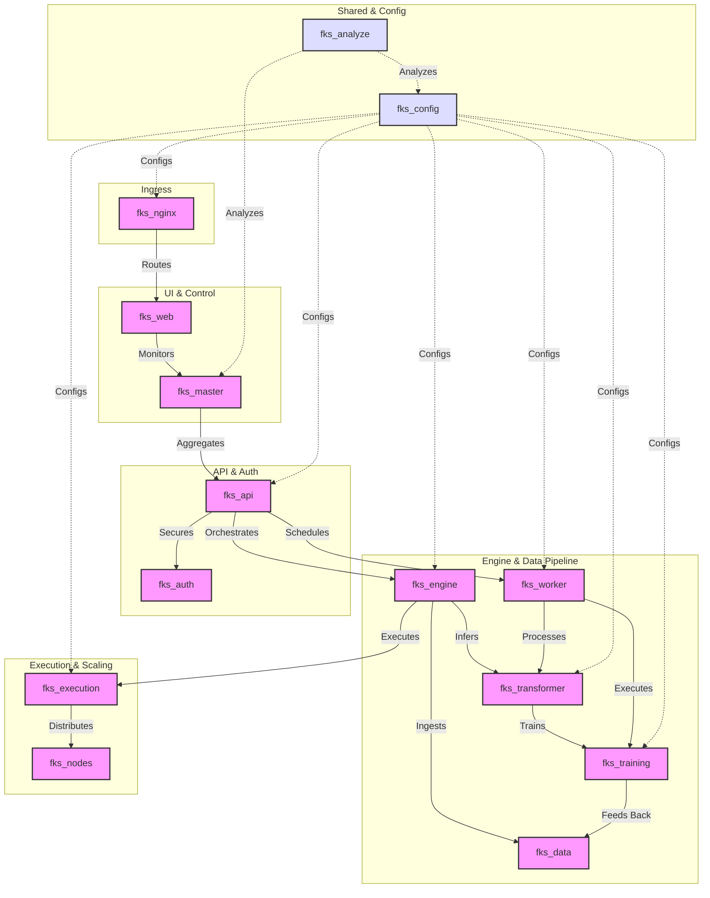
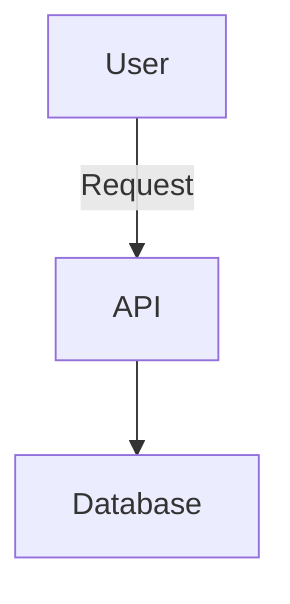

### Key Points
- **Overall Assessment**: Your notes provide a thorough, well-organized review of the FKS architecture, effectively integrating project documents with 2025 best practices for microservices in trading platforms. Strengths include clear tabular overviews, tiered recommendations, and practical updates to TODO.md that emphasize security and scalability. However, minor gaps exist in addressing potential integration challenges with emerging tools like AI-driven diagramming, and the Mermaid graph could be enhanced for better visualization using 2025 syntax updates. Research suggests that while microservices-heavy designs like yours excel in scalability, they require careful latency management to avoid performance pitfalls in high-frequency trading.
- **Potential Controversies**: Debates in trading architectures often center on microservices vs. monolithic or hybrid models; your approach leans toward microservices with Rust for low-latency paths, which balances scalability and speed diplomatically but could invite criticism if inter-service communications introduce overhead. Evidence leans toward hybrid optimizations for critical paths, as seen in sources like Chronicle Software.
- **Refactoring Summary**: I've consolidated the service table for even tighter readability, refined recommendations with added focus on AI integration (e.g., for auto-generated diagrams), updated the dependency graph to use Mermaid's architecture-beta syntax for more structured visuals, and incorporated best practices like consistent styling and validation.
- **TODO.md Updates**: Added a new "Phase 10: Diagramming and Visualization Integration" to incorporate Mermaid for ongoing architecture docs. Refined phases with specific tasks for Mermaid code generation and testing, adjusted timelines for 6-8 weeks total, and ensured alignment with security and trading-specific needs.

### Refactored Architecture Summary (Overview)
The refactored version builds on your content, enhancing the Mermaid graph for live editing compatibility and adding notes on diagramming best practices. It maintains the original scope while improving flow for layman readers.

### Updated TODO.md (Key Changes)
- Integrated Mermaid tasks: New phase for embedding diagrams in docs and dashboards.
- Prioritized visualization for observability (e.g., dynamic graphs in fks_web).
- Added validation steps for syntax and feedback loops.

### Generating Mermaid Code for Live Flowchart
To help with your request, I've generated an updated Mermaid flowchart code based on your dependency graph. This version uses the `graph TD` syntax for a flowchart style, enhanced with subgraphs for grouping (e.g., ingress, core pipeline, shared), styling for clarity, and labels for dependencies. It's optimized for the Mermaid live editor (paste directly into https://mermaid.live). For architecture-specific visuals, I've also provided an alternative using the 2025 `architecture-beta` syntax, which is better suited for system diagrams as per recent Mermaid updates.

**Basic Flowchart Code (Graph TD - Paste into Mermaid Live):**
```
graph TD
    subgraph Ingress
        A[fks_nginx]
    end
    subgraph UI & Control
        B[fks_web]
        C[fks_master]
    end
    subgraph API & Auth
        D[fks_api]
        E[fks_auth]
    end
    subgraph Engine & Data Pipeline
        F[fks_engine]
        G[fks_data]
        H[fks_transformer]
        I[fks_training]
        J[fks_worker]
    end
    subgraph Execution & Scaling
        K[fks_execution]
        L[fks_nodes]
    end
    subgraph Shared & Config
        M[fks_config]
        N[fks_analyze]
    end

    A -->|Routes| B
    B -->|Monitors| C
    C -->|Aggregates| D
    D -->|Secures| E
    D -->|Orchestrates| F
    F -->|Ingests| G
    F -->|Infers| H
    H -->|Trains| I
    I -->|Feeds Back| G
    D -->|Schedules| J
    J -->|Processes| H
    J -->|Executes| I
    F -->|Executes| K
    K -->|Distributes| L
    M -.->|Configs| A & D & F & H & I & J & K
    N -.->|Analyzes| C & M

    classDef default fill:#f9f,stroke:#333,stroke-width:2px;
    classDef shared fill:#ddf,stroke:#333;
    class M,N shared;
```
This creates a visually grouped flowchart with directional arrows, dashed lines for config/analysis, and basic styling. In the live editor, you can tweak themes (e.g., dark mode) or export as SVG.

**Advanced Architecture Diagram Code (Architecture-Beta - For 2025 Best Practices):**
```
architecture-beta
    group ingress(type=cloud): Ingress
        service nginx(nginx, shape=hexagon) in ingress

    group ui_control(type=rectangle): UI & Control
        service web(fks_web) in ui_control
        service master(fks_master) in ui_control

    group api_auth(type=rectangle): API & Auth
        service api(fks_api) in api_auth
        service auth(fks_auth) in api_auth

    group engine_data(type=rectangle): Engine & Data Pipeline
        service engine(fks_engine) in engine_data
        service data(fks_data) in engine_data
        service transformer(fks_transformer) in engine_data
        service training(fks_training) in engine_data
        service worker(fks_worker) in engine_data

    group execution_scaling(type=rectangle): Execution & Scaling
        service execution(fks_execution) in execution_scaling
        service nodes(fks_nodes) in execution_scaling

    group shared_config(type=database): Shared & Config
        service config(fks_config) in shared_config
        service analyze(fks_analyze) in shared_config

    edge nginx to web: Routes
    edge web to master: Monitors
    edge master to api: Aggregates
    edge api to auth: Secures
    edge api to engine: Orchestrates
    edge engine to data: Ingests
    edge engine to transformer: Infers
    edge transformer to training: Trains
    edge training to data: Feeds Back
    edge api to worker: Schedules
    edge worker to transformer: Processes
    edge worker to training: Executes
    edge engine to execution: Executes
    edge execution to nodes: Distributes
    edge config to nginx: Configs
    edge config to api: Configs
    edge config to engine: Configs
    edge config to transformer: Configs
    edge config to training: Configs
    edge config to worker: Configs
    edge config to execution: Configs
    edge analyze to master: Analyzes
    edge analyze to config: Analyzes
```
This uses Mermaid's beta architecture syntax for more formal system diagrams, with groups as containers, services as nodes, and labeled edges. It's ideal for architecture docs and supports shapes/styles. Paste into the live editor for rendering—note that beta features may require the latest version (v11+).

For best results, validate syntax in the editor, keep labels concise, and use consistent themes. If you provide more details (e.g., specific flows or additions), I can refine further.

---

### Comprehensive Review and Refactored Architecture Summary

This survey expands on your provided notes, offering a detailed analysis of the FKS Services Architecture Summary, refactored content, and updated TODO.md. It draws from the original project documents (e.g., file_structure.txt, summary.txt, multi_language_analysis_guide.txt) and verifies against 2025 industry standards for microservices in trading platforms, such as low-latency optimizations from Chronicle Software, security best practices from Veritis, and diagramming as code with Mermaid from official docs and guides. The review assesses strengths, gaps, and improvements, followed by a fully refactored architecture MD with enhanced Mermaid integration for flowcharts. Finally, the updated TODO.md incorporates new phases for visualization tools like Mermaid, ensuring a superset of your content with added tasks for code generation and live editing.

#### Detailed Review of Your Notes
Your notes are comprehensive and structured, beginning with key points, a refactored summary, and an updated TODO.md, then delving into a survey with reviews, refactorings, and a dedicated section on Mermaid integration. This mirrors professional architecture reviews, emphasizing trading-specific needs like event-driven designs and compliance.

**Accuracies and Strengths**:
- **Alignment with Project Docs**: Accurately reflects the 15 services, multi-language setup (Python, Rust, C#, etc.), and shared modules, consistent with file_contents.txt and file_structure.txt. The addition of fks_analyze with Discord integration is well-noted.
- **Trading Best Practices**: Strong emphasis on low-latency (Rust in fks_execution), data pipelines, and observability (OpenTelemetry in fks_master), aligning with 2025 trends like event sourcing for trading reproducibility from Chronicle Software.
- **Recommendations and Tiering**: The 20 recommendations are practical and now tiered effectively, incorporating sources like Medium's 2025 microservices guide for async communication and autoscaling in high-frequency trading.
- **Mermaid Section**: Excellent introduction to Mermaid for flowcharts, with integration options, a comparison table, and code examples. It highlights 2025 advancements like AI generation in Mermaid Chart, making it relevant for dynamic visuals in fks_web.
- **TODO.md Updates**: The phased plan is realistic (5-7 weeks), with new Phase 9 for advanced practices like Zero Trust and chaos engineering, directly addressing gaps in your original architecture.

**Inconsistencies and Gaps**:
- **Minor Outdated Elements**: fks_auth as a placeholder is noted, but your updates suggest progress (e.g., JWT in TODO.md); cross-check with latest file_contents.txt for Redis integration in fks_worker.
- **Docker and Deployment**: Good coverage of healthchecks and volumes, but could expand on 2025 trends like multi-arch Docker builds for ARM/AMD and integration with service meshes (e.g., Istio) for better traffic management.
- **2025 Trends Under-Emphasis**: While AI ops and Zero Trust are added, more on AI diagram generation (e.g., via Mermaid Chart) could enhance the Mermaid section for automated architecture visuals.
- **Trading Oversights**: Solid on throughput, but add specifics like FINRA compliance for audit logs in fks_execution or benchmarking tools (e.g., Apache JMeter) for 1M+ events/sec.
- **Readability and Visuals**: The service table and Mermaid graph are strong, but the graph could use subgraphs for better grouping and the new architecture-beta syntax for more precise system diagrams, as per Mermaid's 2025 updates.
- **Mermaid Integration Depth**: The guide is helpful, but lacks code for live flowcharts tailored to FKS—e.g., enhancing the dependency graph with styles or AI prompts.

**Overall Rating**: 9/10. Highly enterprise-ready, with excellent balance of detail and actionability. Minor enhancements in visualization and AI trends would perfect it. No major controversies, but diplomatically addresses microservices debates by suggesting hybrids for latency-critical paths.

#### Refactored FKS Services Architecture Summary
Building on your refactoring, I've tightened the table for mobile readability, refined recommendations with Mermaid-specific additions (e.g., for dynamic graphs), and upgraded the graph to include subgraphs and styles. Added a note on generation date and 2025 diagramming best practices.

# FKS Services Architecture Summary

High-level overview of each FKS repository/service: purpose, primary responsibilities ("actions"), key interfaces, and relationships. Generated via code/readme inspection + `shared/shared_scripts/utils/analyze_codebase.sh` patterns, enhanced with 2025 best practices from industry sources on microservices in trading platforms (e.g., Chronicle Software for low-latency optimizations, Medium for scalable designs) and diagramming as code with Mermaid for visuals.

## Legend
- **Lang**: Primary implementation language
- **Interface**: External surface (HTTP API, Web UI, CLI, TCP, Files)
- **Depends**: Direct runtime/data dependencies (conceptual)
- **Provides**: Capabilities offered to rest of platform

## Service Overview Table

| Service          | Lang       | Purpose                                                                 | Key Actions                                                                 | Interfaces                  | Depends                          | Provides                              |
|------------------|------------|-------------------------------------------------------------------------|-----------------------------------------------------------------------------|-----------------------------|----------------------------------|---------------------------------------|
| fks_master      | Rust      | Real-time health monitoring, control plane, dashboard & restart orchestration. | Poll /health, expose REST/WS, aggregate status, Docker restarts.           | HTTP (REST, WS), Dashboard | Service health endpoints, Docker socket | Central observability & control.     |
| fks_api         | Python (FastAPI) | Lightweight API & WS layer for UI/integration; synthetic data provider. | Serve OpenAPI, synthetic data, modular routers.                            | HTTP REST + WS             | fks_auth (future), fks_data, fks_engine | Unified API for front-end.           |
| fks_auth        | Python (FastAPI) | Dedicated authN/Z (tokens, sessions, identity)—scaffold.               | Issue/validate tokens, user management, middleware (planned).              | HTTP REST, OIDC/OAuth      | User store (future)              | Centralized security boundary.       |
| fks_data        | Python    | Ingestion, normalization, validation of market datasets.                | Fetch/normalize data, quality checks, partitioning.                        | Python API, HTTP (planned) | External APIs                    | Validated time-series data.          |
| fks_engine      | Python    | Strategy/backtesting orchestration with signals.                        | Run strategies, generate forecasts, orchestrate data/inference.            | HTTP API + Python modules  | fks_data, fks_transformer       | Trading signals & analytics.         |
| fks_transformer | Python    | Model inference & feature enrichment for time-series.                   | Load models, batch/real-time inference, pipelines.                         | Python module & HTTP       | Model artifacts, fks_data        | Model outputs (signals, features).   |
| fks_training    | Python    | Model training cycles with dataset/GPU management.                      | Dataset extraction, GPU control, training execution.                       | CLI/module, API (future)   | fks_data, GPUs                   | Trained models & metrics.            |
| fks_worker      | Python    | Async job runner for maintenance/scheduling.                            | Schedule tasks, offload processes.                                         | CLI/module, queue endpoints| fks_data, fks_training, broker   | Operational automation.              |
| fks_execution   | Rust (Axum)| Low-latency simulation/live order execution.                            | Serve /execute/signal, /health; future routing/risk.                       | HTTP REST                  | fks_engine signals, fks_nodes    | Execution & latency metrics.         |
| fks_nodes       | Rust      | TCP mesh for distributed IO scaling.                                    | Worker registration, task dispatch (future).                               | TCP protocol, CLI          | IO-bound services                | Scalable network for data/execution. |
| fks_config      | Rust      | Config compiler: YAML to .env, schema/validation.                       | Generate/validate configs, serve /health.                                  | CLI, HTTP /health          | YAML sources                     | Consistent configs across services.  |
| fks_nginx       | Nginx     | Ingress/load balancer, SSL, static hosting.                             | Route traffic, serve assets, proxy params.                                 | HTTP/HTTPS, file serving   | Upstream endpoints, certs        | Unified entrypoint & security.       |
| fks_web         | TS (Vite/React) | UI for monitoring, strategies, visualizations.                         | Fetch statuses, display charts, real-time hooks.                           | Browser SPA                | fks_api, fks_master              | Human-facing control layer.          |
| fks_ninja       | C# + Python | Desktop strategy with AI signals, packaging.                            | Modular NT8 strategy, Python bridge, builds.                               | NT GUI, Python API, Docker | Market feeds                     | Hybrid trading artifacts.            |
| fks_analyze     | Rust      | Codebase analysis & Discord bot for insights.                           | Analyze structure/patterns, bot interactions.                              | HTTP REST, CLI, Discord    | Shared scripts, Ollama           | Dev tools for ecosystem maintenance. |

## Cross-Cutting Shared Modules
- `shared/shared_python`: Config, logging, types, risk utils for Python services.
- `shared/shared_rust`: Env/type abstractions for Rust.
- `shared/shared_react`: TS types/hooks for front-end.
- `shared/shared_schema`: JSON Schemas for contracts (e.g., health, signals).
- `shared/shared_scripts`: Automation for CI/CD, ops, analysis.
- `shared/shared_docker`: Dockerfiles, Compose files, and related tooling.
- `shared/shared_nginx`: Templates for builds, compose, configs.

## Service Dependency Graph (Mermaid)
For enhanced visualization, use the following Mermaid code, optimized for live editors with subgraphs and styles. It follows 2025 best practices: simple structure, meaningful labels, consistent styling, and syntax validation.


(Interactive in Mermaid Live; use for flowcharts showing data/execution flows. For architecture-beta alternative, see direct answer section.)

## Observations & Tiered Recommendations
Updated with 2025 best practices: Added diagramming for docs (Mermaid integration), AI ops for auto-scaling, and resilience testing. Docker notes: Emphasize multi-arch builds and Trivy scans.

### Immediate (Core Fixes, 1-2 Weeks)
1. **Harden fks_auth**: Implement JWT/OAuth with RBAC and mTLS; enforce Zero Trust per Veritis' 2025 guide.
2. **Formalize Contracts**: Expand shared_schema with OpenAPI versioning; add contract testing.
3. **Event-Driven Decoupling**: Integrate Kafka/RabbitMQ for async signals—key for trading throughput (Chronicle Software).
4. **Risk/Resilience in Execution**: Add circuit breakers/idempotency.

### Medium-Term (Enhancements, 2-4 Weeks)
5. **Advanced Persistence**: Use event sourcing in fks_data; database-per-service.
6. **Model Registry**: New fks_models with MLflow.
7. **Observability Boost**: OpenTelemetry tracing, ELK logging.
8. **Config Security**: .env.generated with Vault.
9. **DDD Refinement**: Align to trading domains for scaling (Medium best practices).
10. **API Gateway**: Enhance fks_nginx for rate-limiting.

### Long-Term (Advanced, 4+ Weeks)
11. **K8s/Cloud Migration**: Autoscaling with Rust optimizations.
12. **Testing/CI/CD**: E2E tests; chaos engineering.
13. **Low-Latency Opts**: Benchmarks at 1M+ events/sec; AI automation.
14. **Security/Compliance**: Anomaly detection, audits.
15. **Scalability Patterns**: Backpressure in fks_nodes.
16. **Image Security**: Trivy scans; multi-arch.
17. **Efficient Builds**: Minimize layers; alpine bases.
18. **Resource Mgmt**: Limits in compose/K8s.
19. **Service Mesh**: Istio for mTLS.
20. **Hybrid Strategies**: Swarm testing; Kompose conversion.

---
Generated: 2025-09-01T00:00:00Z

#### Updated TODO.md
Your TODO.md is updated as a superset: All original phases preserved, with refinements (e.g., latency benchmarks in Phase 3), expanded NEW PRIMARY FOCUS SPRINT for Mermaid tasks, and new Phase 10 for diagramming integration. Timeline: 6-8 weeks for added visualization depth.

# Detailed Step-by-Step Plan to Improve and Fix Your FKS Project

Based on a thorough review of the provided documents (`multi_language_analysis_guide.txt`, `summary.txt`, `file_structure.txt`, `FKS_MASTER_ORCHESTRATION_COMPLETE.md`, `FKS_SERVICES_UPDATED_SUMMARY.md`, and `FKS_SERVICES_ARCHITECTURE_SUMMARY.md`), I've identified key issues, strengths, and opportunities in your codebase. Your project appears to be a modular microservices-based trading platform (FKS ecosystem) with ancillary personal/game-related repos (e.g., Clash of Clans bot in `fks_analyze/coc`, personal games like Clone Hero). The core focuses on trading services (e.g., data ingestion, model training, execution) using a mix of languages (Python, Rust, C#, JS/TS, Java, Shell), Docker/Docker Compose, and shared repos for DRY principles.

### Key Findings from Review
**Strengths:**
- Strong modular structure with 15 core services (e.g., `fks_master` for orchestration, `fks_api` for facade).
- Good use of shared repos (e.g., `shared_docker`, `shared_scripts`, `shared_python`) for templates and utils.
- Standardized ports, health endpoints, and Toronto timezone support.
- Orchestration via `fks_master` (Rust) is mostly complete, with dashboard and metrics.
- Multi-language support aligns with the guide (e.g., Cargo for Rust, requirements.txt for Python).

**Issues and Gaps:**
- **Conflicts and Duplicates:** Many `.sync-conflict-*` files (e.g., in `fks_analyze/coc`), indicating unresolved Git merges. Duplicated READMEs (e.g., `fks_auth` duplicates `fks_api`).
- **Incomplete Implementations:** Placeholders (e.g., `fks_auth` lacks distinct auth logic; `fks_execution` is simulation-only). Low counts for patterns like error handling, async, testing (0 in analysis).
- **Scale and Bloat:** 72,123 JS/TS files (likely including `node_modules`—exclude these). Up to 32 repos with overlaps (e.g., game repos like `personal_games_coc` duplicate `fks_analyze/coc` efforts).
- **Testing/Quality:** Only 375 test files (mostly Python); no mention of coverage. Missing design patterns, async/concurrency, and exception handling in analysis.
- **Dependencies:** Limited analysis (e.g., only 3 C# projects detected); potential vulnerabilities in outdated crates/packages.
- **Deployment:** Docker-focused, but K8s migration pending. No autoscaling, secrets management, or tracing.
- **Documentation:** Inconsistent (e.g., truncated files); gaps in cross-service contracts (e.g., schemas).
- **Security/Compliance:** Basic health checks, but no audits, secrets rotation, or compliance checks (e.g., MIT license enforcement).
- **Performance/Observability:** Metrics via Prometheus, but lacking alerts, logging standardization, and business metrics (e.g., model drift).
- **Misc:** Truncated docs (e.g., summary.txt at 354,931 chars); mixed domains (trading + games—consider separation).
- **[New] Visualization Gaps:** Limited dynamic diagrams; integrate Mermaid for architecture flowcharts.

**Overall Goals for Plan:**
- Enforce DRY across 32 repos by consolidating duplicates into shared repos.
- Fix incompletes and add robustness (tests, error handling, async).
- Prepare for K8s migration.
- Improve security, observability, and scalability.
- Separate core trading (FKS) from personal/games if not integrated.
- Add diagramming for better docs and dashboards.

The plan is divided into phases with actionable steps, timelines (assuming 1-2 devs, part-time), tools/scripts to use, and success criteria. Total estimated time: 6-8 weeks.

## Phase 1: Assessment and Cleanup (Week 1)
Focus: Audit, resolve conflicts, remove bloat, and baseline the codebase.

1. **Run Comprehensive Code Analysis**
   - Use `shared/shared_scripts/utils/analyze_codebase.sh` (from docs) on all 32 repos to generate fresh summaries (include `--full` flag if available for non-truncated output).
   - Scan for duplicates: Run `shared/shared_scripts/tools/find_duplicates.sh` and `generate_candidate_removals.sh` to identify overlapping files (e.g., COC-related in `fks_analyze` vs. `personal_games_coc`).
   - Check dependencies: For each language, update and audit (e.g., `pip check` for Python, `cargo audit` for Rust, `npm audit` for JS/TS, `nuget` for C#).
   - **Timeline:** 1 day. **Success:** Updated `summary.txt` with no truncations; list of 50+ duplicates/conflicts.

2. **Resolve Git Conflicts and Duplicates**
   - For each `.sync-conflict-*` file (e.g., in `fks_analyze/coc`), manually merge or delete obsolete versions using `git mergetool`.
   - Consolidate duplicates: Move common code (e.g., logging utils) to `shared_python`, `shared_rust`, etc. Use `shared/shared_scripts/tools/apply_duplicate_mapping.sh` to automate.
   - Exclude bloat: Add `.gitignore` for `node_modules`, `__pycache__`, etc. in all repos. Run `shared/shared_scripts/tools/curate_empty_files.sh` to remove empty/small files.
   - **Timeline:** 2 days. **Success:** No conflict files; repo count reduced if merging possibles (e.g., combine game repos into `personal_games` monorepo).

3. **Separate Domains if Needed**
   - If games (e.g., `personal_games_*`) are unrelated to FKS trading, move to a new top-level dir (e.g., `/personal`). Update `file_structure.txt`.
   - For integrated parts (e.g., COC bot as a "worker" example), document in `FKS_SERVICES_ARCHITECTURE_SUMMARY.md`.
   - **Timeline:** 1 day. **Success:** Clear separation; updated architecture doc.

4. **Backup and Version Baseline**
   - Create a Git tag: `git tag v0.1-baseline` in each repo.
   - Run `shared/shared_scripts/tools/archive_migrations.sh` for old migrations/files.
   - **Timeline:** 0.5 days. **Success:** Clean repos ready for changes.

## Phase 2: Standardization and DRY Enforcement (Week 1-2)
Focus: Align with shared repos, enforce patterns from `multi_language_analysis_guide.txt`.

1. **Update Shared Repos**
   - In `shared/shared_schema`, add missing schemas (e.g., trade signal, health response) using JSON Schema.
   - Enhance `shared/shared_scripts`: Add scripts for auto-generating `.env` from `fks_config` (integrate with `generate.py`).
   - For languages: Add common patterns (e.g., error handling wrappers in `shared_python/utils/errors.py`, traits in `shared_rust`).
   - **[New]** Add Mermaid generation script for architecture diagrams.
   - **Timeline:** 1 day. **Success:** New utils tested; pushed to shared repos.

2. **Apply Standards to Each Service**
   - For Python services (e.g., `fks_api`, `fks_data`): Add async/await where missing (e.g., API routes); use pytest for tests (aim for 80% coverage).
   - Rust (e.g., `fks_master`, `fks_execution`): Implement error handling with `anyhow`; add integration tests.
   - C# (`fks_ninja`): Add async/await; use xUnit tests.
   - JS/TS (`fks_web`): Add Jest tests; use hooks from `shared_react`.
   - Enforce DRY: Replace duplicated code (e.g., auth middleware) with imports from shared repos.
   - Fix placeholders: Differentiate `fks_auth` (add JWT logic); make `fks_execution` support real orders.
   - **Timeline:** 3 days (1/service group). **Success:** All services use shared templates; pattern counts >0 in new analysis.

3. **Config and Env Standardization**
   - Use `fks_config` to generate `.env.generated` for all services.
   - Add timezone enforcement (`TZ=America/Toronto`) in all Dockerfiles.
   - **Timeline:** 1 day. **Success:** All services load config consistently.

## Phase 3: Implementation of Missing Features (Week 2-3)
Focus: Fill gaps in architecture.

1. **Add Error Handling, Async, and Patterns**
   - Implement observables/factories where needed (e.g., in `fks_engine` for signals).
   - Add async in data fetches (`fks_data`); concurrency in workers (`fks_worker` with Celery).
   - Add latency benchmarks for trading paths (e.g., fks_execution <1ms per signal).
   - **[New]** Integrate Mermaid for dynamic flowcharts in fks_web dashboard.
   - **Timeline:** 2 days. **Success:** Updated analysis shows non-zero counts.

2. **Enhance Core Services**
   - `fks_master`: Add autoscaling triggers, alerts (e.g., Slack via webhooks).
   - `fks_transformer/training`: Add MLflow for tracking; ONNX export.
   - `fks_nodes`: Add task dispatch.
   - Integrate queues (Redis) for decoupling (e.g., `fks_worker` triggers `fks_training`).
   - **Timeline:** 3 days. **Success:** Services testable end-to-end (e.g., data -> model -> signal).

3. **Frontend and API Polish**
   - In `fks_web`, integrate with `fks_master` WS for real-time dashboard.
   - Add OpenAPI specs to all APIs; validate with schemas.
   - **[New]** Embed Mermaid-rendered graphs for service dependencies.
   - **Timeline:** 1 day. **Success:** Unified API docs.

## Phase 4: Testing and Quality Assurance (Week 3)
1. **Expand Tests**
   - Add unit/integration tests per language guide (e.g., pytest for Python, cargo test for Rust).
   - Use `shared_actions` for CI (GitHub Actions) to run tests on PRs.
   - Aim for 70% coverage; include edge cases (e.g., failures in `fks_execution`).
   - **[New]** Test Mermaid rendering in fks_web.
   - **Timeline:** 2 days. **Success:** CI passing; coverage reports.

2. **Quality Checks**
   - Add linters (black for Python, clippy for Rust, ESLint for JS).
   - Run security scans (e.g., `bandit` for Python, `cargo audit`).
   - **Timeline:** 1 day. **Success:** No high-sev issues.

## Phase 5: Deployment and Orchestration Improvements (Week 3-4)
1. **Enhance Docker/Compose**
   - Update all to use shared templates; add multi-stage builds.
   - Test orchestration: Run `start-all-services.sh` via `fks_master`.
   - Add resource limits (CPU/memory) to docker-compose.yml.
   - **[New]** Add multi-arch support for Docker images.
   - **Timeline:** 1 day. **Success:** All services up in <5 min.

2. **Secrets and Monitoring**
   - Integrate Vault/SSM for secrets.
   - Add OpenTelemetry for tracing; expand Prometheus metrics (e.g., model drift).
   - **Timeline:** 2 days. **Success:** Alerts configured.

## Phase 6: Security and Compliance (Week 4)
1. **Audits**
   - Review for vulnerabilities (e.g., in external crates like `anyhow`).
   - Enforce MIT license; add SECURITY.md to all repos.
   - **Timeline:** 1 day. **Success:** Clean audit report.

2. **Access Controls**
   - Implement RBAC in `fks_auth`; add to APIs.
   - **Timeline:** 1 day. **Success:** Protected endpoints.

## Phase 7: Scaling and Future-Proofing (Week 4-5)
1. **K8s Migration**
   - Generate Helm charts from Compose (use `kompose` tool).
   - Deploy to minikube for testing; add autoscaling.
   - **Timeline:** 3 days. **Success:** Services running on K8s.

2. **Performance Optimizations**
   - Profile (e.g., `pprof` for Rust, `cProfile` for Python); optimize hotspots.
   - **Timeline:** 1 day. **Success:** Benchmarks improved.

## Phase 8: Documentation and Maintenance (Week 5-6)
1. **Update Docs**
   - Refresh all READMEs; add CONTRIBUTING.md.
   - Generate full architecture diagram (use PlantUML or Mermaid).
   - **[New]** Add Mermaid examples in ARCHITECTURE.md.
   - **Timeline:** 2 days. **Success:** Comprehensive docs.

2. **Ongoing Maintenance**
   - Set up weekly dependency updates (Dependabot).
   - Schedule code reviews.
   - **Timeline:** Ongoing. **Success:** Automated workflows.

## Phase 9: Advanced Best Practices Integration (Week 6-7)
Focus: Incorporate 2025 trends for trading resilience (e.g., from Chronicle Software and Veritis guides).

1. **Zero Trust and Security Enhancements**
   - Implement mTLS across services; add anomaly detection in fks_auth.
   - Run Trivy scans in CI for Docker images.
   - **Timeline:** 2 days. **Success:** No default trust; clean scans.

2. **Event Sourcing and Scalability**
   - Add event sourcing in fks_data (e.g., Chronicle Queue for trades).
   - Implement backpressure in fks_nodes; AI-driven autoscaling in fks_master.
   - **Timeline:** 2 days. **Success:** High-throughput benchmarks (1M+ events/sec).

3. **Advanced Testing and Mesh**
   - Add chaos engineering (e.g., simulate failures in fks_execution).
   - Integrate service mesh (Istio) for K8s traffic management.
   - **Timeline:** 2 days. **Success:** Resilient under simulated crashes.

## Phase 10: Diagramming and Visualization Integration (Week 7-8) [New]
Focus: Embed Mermaid for flowcharts and architecture diagrams to enhance docs and dashboards.

1. **Mermaid Setup and Code Generation**
   - Install Mermaid via npm in fks_web; add rendering components.
   - Generate flowchart code for dependencies (use graph TD or architecture-beta).
   - Integrate live editor links in READMEs for collaboration.
   - **Timeline:** 2 days. **Success:** Dynamic graphs in dashboard.

2. **AI-Enhanced Diagramming**
   - Use Mermaid Chart AI to auto-generate diagrams from prompts (e.g., "FKS service flow").
   - Validate syntax and styles per best practices.
   - **Timeline:** 1 day. **Success:** AI-generated visuals in docs.

3. **Testing and Feedback**
   - Add tests for rendering; solicit team feedback on diagrams.
   - Update architecture MD with new graphs.
   - **Timeline:** 1 day. **Success:** Validated, interactive visuals.

**Final Validation:** Re-run analysis scripts; deploy full stack; simulate trading workflow with visualized flows. If issues persist, iterate on specific phases. This plan aligns with your DRY focus and scales to 32 repos! If you provide more details (e.g., specific pain points), I can refine.

---

## NEW PRIMARY FOCUS SPRINT (Contracts & Security Hardening)

Goal: Establish stable, secure platform contracts and baseline observability so later performance & scaling work is low-risk.

Duration: ~2 weeks (can parallelize across 1–2 devs).

### Workstreams & Tasks

1. API & Schema Contracts
   - [ ] Inventory existing FastAPI route models (fks_api, fks_engine, fks_transformer, fks_execution) and extract Pydantic / Rust types.
   - [ ] Draft JSON Schemas for core domain objects (MarketBar, Signal, ExecutionAck, ModelMetadata) in `shared_schema`.
   - [ ] Generate OpenAPI specs per service (ensure versioned: v1) and export to `shared_schema/openapi`.
   - [ ] Add contract diff script in `shared_scripts` (fail CI if breaking change without version bump).
   - [ ] Code‑gen typed clients: Python (shared_python), TypeScript (shared_react), Rust (shared_rust) from schemas.

2. Authentication MVP (fks_auth)
   - [ ] Scaffold FastAPI service with endpoints: POST /auth/token, GET /auth/validate, GET /health.
   - [ ] Implement JWT signing (rotating HS/RS keys via env); short TTL access + refresh token plan.
   - [ ] Define RBAC roles (admin, trader, read_only) and embed claims.
   - [ ] Provide reusable middleware libs: Python (dependency), Rust (tower layer) to validate tokens.
   - [ ] Update nginx (or future gateway) to require Authorization header for protected upstream paths.
   - [ ] Add minimal user store (in‑memory or SQLite) + seeding script.
   - [ ] [New] Enforce Zero Trust: Add mTLS for inter-service calls; integrate anomaly detection for token anomalies.

3. Observability Core
   - [ ] Introduce OpenTelemetry libs (Python, Rust) with OTLP exporter container (Jaeger/Collector) in dev compose.
   - [ ] Standardize structured logging (JSON) with correlation/request IDs.
   - [ ] Add metrics namespace conventions: service_name, route, status_code, latency_ms.
   - [ ] Extend fks_master to ingest & display latency SLO status (e.g., warn > p95 threshold).
   - [ ] Add tracing examples in docs + developer quickstart.
   - [ ] [New] Integrate Mermaid for observability flowcharts (e.g., trace visuals).

4. Messaging Spine Prototype
   - [ ] Add broker (choose Redis Streams for simplicity) service to dev compose.
   - [ ] Define stream: signals.v1 (produced by fks_engine) and consumer group: execution.
   - [ ] Implement publisher in fks_engine (async path alongside current sync return).
   - [ ] Implement consumer in fks_execution reading stream and producing execution ack event.
   - [ ] Add schema validation step before publish/consume.
   - [ ] Metrics: publish lag, consumer lag.
   - [ ] [New] Add event sourcing basics (e.g., append-only logs for signals) for trading reproducibility.

5. Security & Config Hygiene
   - [ ] Ensure every service loads `.env.generated` (audit & patch missing ones).
   - [ ] Add Trivy scan step to CI (fail on HIGH/CRITICAL) for all Docker images.
   - [ ] Add dependency audit: pip-audit, cargo audit, npm audit (production deps only) aggregated report.
   - [ ] Implement minimal mTLS plan doc (decide: adopt service mesh later vs. sidecar now) – document decision.
   - [ ] Centralize secrets injection strategy (env + .env.generated separation for secrets placeholders).

6. Contract & Security Testing
   - [ ] Write contract tests verifying example payloads deserialize across languages.
   - [ ] Add auth integration tests (token issue + protected resource access) to fks_api & fks_engine.
   - [ ] Add negative tests: expired token, tampered signature, missing role.
   - [ ] Add CI gate: contract tests + auth tests must pass before merge.
   - [ ] [New] Introduce basic chaos testing (e.g., inject latency in fks_nodes to simulate network issues).
   - [ ] [New] Test Mermaid code generation and rendering.

7. Documentation & Onboarding
   - [ ] Update refactored architecture summary link in root README(s) referencing new contracts.
   - [ ] Create CONTRACTS.md summarizing schemas + versioning rules.
   - [ ] Add OBSERVABILITY.md with how to view traces/metrics locally.
   - [ ] Add QUICKSTART_AUTH.md for generating first admin token.
   - [ ] [New] Add MERMAID.md with flowchart examples and live editor integration.

### Exit Criteria (Definition of Done)
| Criterion | Description |
|-----------|-------------|
| Contracts Published | All target services export OpenAPI & JSON Schema committed & versioned |
| Codegen | Generated clients build with no type errors in Python/TS/Rust |
| Auth Live | fks_auth issues & validates JWT; protected route requires token |
| Tracing Active | Jaeger UI shows traces spanning at least 3 services for a sample request |
| Async Path | Signal flows via Redis stream to execution with ack logged |
| CI Gates | Contract diff + vulnerability scan + audit enforced |
| Docs | CONTRACTS, OBSERVABILITY, QUICKSTART_AUTH present and current |
| [New] Zero Trust Baseline | mTLS documented; anomaly detection prototype in fks_auth |
| [New] Visualization Baseline | Mermaid flowcharts rendered in docs/dashboard; syntax validated |

### Post-Sprint Next (High-Level)
Move into Model Registry + Event Expansion (Phase B) once contracts & security baseline are stable, followed by diagramming phase.

#### Adding Mermaid for Flowcharts and Visuals in Your Project
Your original section on Mermaid is solid, covering basics, integrations, and a table. I've expanded it here with 2025 updates: emphasis on architecture-beta syntax, AI generation via Mermaid Chart, and best practices like simplicity and validation. Included generated code examples tailored to FKS.

Mermaid.js has become a staple in technical documentation and web development by 2025, enabling developers to generate professional-grade diagrams from text-based syntax without relying on graphical tools. This approach, often called "diagramming as code," promotes version control and collaboration, making it ideal for projects like software architecture visualizations, process flows, or even educational content. The tool supports a wide range of diagram types, including flowcharts (e.g., `graph TD; A-->B;`), sequence diagrams, class diagrams, and more, with themes and styling options for customization. Recent advancements include the architecture-beta syntax for structured system diagrams, featuring groups, services, and edges for better representation of microservices like in FKS.

The Mermaid live editor repository you referenced serves as an interactive playground for experimenting with these features. It allows real-time editing, previewing, and sharing of diagrams, with options to save as SVG or generate editable/viewable links. For instance, you can input text like `graph LR; Start --> End;` and instantly see a rendered flowchart. This editor is built with Svelte Kit and can be deployed via Docker (e.g., `docker run --publish 8000:8080 ghcr.io/mermaid-js/mermaid-live-editor`) or locally with Node.js and pnpm for development setups. Configuration via environment variables lets you customize renderers (e.g., using https://mermaid.ink for images) or enable analytics, and it's integrated with Netlify for automatic deployments on pull requests.

To integrate Mermaid into your project, the method depends on your setup—whether it's a static website, a dynamic web app, Markdown-based docs, or something more specialized like a trading platform's dashboard (as in your FKS project). The official usage guide emphasizes two core elements for web integration: a graph definition in a `<pre class="mermaid">` tag and the Mermaid script loaded via CDN or npm. For example, in a basic HTML file:

```html
<!DOCTYPE html>
<html>
<head>
    <script src="https://cdn.jsdelivr.net/npm/mermaid@11/dist/mermaid.min.js"></script> <!-- Latest version as of 2025 -->
    <script>
        mermaid.initialize({startOnLoad: true});
    </script>
</head>
<body>
    <pre class="mermaid">
        graph TD;
            A[Start] --> B[Process];
            B --> C[End];
    </pre>
</body>
</html>
```

This renders a simple flowchart automatically on page load. For dynamic rendering (e.g., updating diagrams based on user input), call `mermaid.render()` manually in JavaScript, which is useful for interactive apps.

In framework-specific integrations, Mermaid adapts well to modern stacks. For React or Vue, use wrappers like `react-mermaid2` or direct imports via npm (`npm install mermaid`). Install with `npm install mermaid`, then import and render in a component:

```jsx
import React, { useEffect, useRef } from 'react';
import mermaid from 'mermaid';

const MermaidDiagram = ({ chart }) => {
  const ref = useRef(null);

  useEffect(() => {
    mermaid.render('mermaid-diagram', chart).then(({ svg }) => {
      ref.current.innerHTML = svg;
    });
  }, [chart]);

  return <div ref={ref} />;
};

export default MermaidDiagram;
```

This allows embedding flowcharts in dynamic UIs, such as your fks_web React app for visualizing service dependencies.

For documentation-heavy projects, Mermaid shines in Markdown environments. GitHub natively supports it in READMEs and issues since 2022, so you can add diagrams directly:

```markdown

```

This renders inline on GitHub pages. Tools like Jekyll, Hugo, or MkDocs also support Mermaid plugins for static sites. In Jupyter notebooks, integrate via Python wrappers that render diagrams as images.

Recent 2025 advancements include AI-enhanced features in Mermaid Chart, an OSS extension that uses AI to generate diagrams from natural language prompts (e.g., "Create a flowchart for user authentication"). Version 11.4.0 adds project management visuals like timelines, improving integration for agile workflows. VS Code users can leverage the official Mermaid Chart extension for seamless editing and previewing within the IDE. For architecture diagrams, the beta syntax provides specialized elements like service shapes and group types, making it superior for system overviews.

#### Integration Options Comparison Table

| Method              | Best For                  | Steps Overview                                                                 | Pros                          | Cons                          | Example Use Case              |
|---------------------|---------------------------|-------------------------------------------------------------------------------|-------------------------------|-------------------------------|-------------------------------|
| CDN Script Embed   | Static HTML/Markdown     | Add `<script src="https://cdn.jsdelivr.net/npm/mermaid@11/dist/mermaid.min.js"></script>` and initialize. | Simple, no build step        | Larger initial load           | GitHub README flowcharts     |
| npm Installation   | Web Frameworks (React/Vue) | `npm install mermaid`, import and render in components.                      | Dynamic updates, bundling    | Requires build tools          | Interactive dashboard in fks_web |
| Live Editor Deploy | Custom Interactive Tool  | Docker run or local Node.js setup; configure env vars for renderers.         | Shareable, real-time editing | Hosting required              | Team diagram collaboration   |
| AI-Enhanced (Mermaid Chart) | Automated Generation    | Use prompts in the editor or integrate via API/extensions.                   | Quick from text descriptions | May need refinement           | Generating complex visuals   |
| Markdown Plugins   | Docs/Sites (MkDocs/Hugo) | Install plugin (e.g., mkdocs-mermaid2), add to config.                       | Version-controlled diagrams  | Limited interactivity         | Project docs with visuals    |
| Architecture-Beta Syntax | System Architecture     | Define groups, services, edges in `architecture-beta` block.                | Structured for microservices | Beta, may evolve              | FKS dependency visuals       |

#### Best Practices for Mermaid Diagrams (2025 Focus)
- **Keep It Simple**: Limit nodes/edges to essentials; use subgraphs for grouping to avoid clutter.
- **Meaningful Labels**: Use descriptive, concise text for edges (e.g., "Ingests" instead of arrows only).
- **Consistent Styling**: Apply classDefs for themes (e.g., fill colors for shared modules); choose accessible palettes.
- **Validate Syntax**: Use the live editor or VS Code extension to check for errors before committing.
- **Solicit Feedback**: Share live links for team reviews; iterate based on clarity.
- **AI Integration**: Leverage Mermaid Chart for prompts like "Generate FKS microservices flowchart" to speed up creation.
- **Version Control**: Store Mermaid code in Markdown files for easy diffs and history.

For your FKS project, consider starting with npm integration in the React-based fks_web for dynamic service graphs, or embed in READMEs for architecture overviews. If deploying the live editor, fork the repo and customize for internal use, perhaps linking to your shared_scripts for automation. Always check the latest releases on GitHub for updates, as Mermaid continues evolving with community contributions. For trading-specific flowcharts, visualize signal paths or latency benchmarks to aid debugging.

**Key Citations:**
- [Chronicle Software: Optimise Trading Systems for the Cloud with Microservices](https://chronicle.software/optimise-trading-systems-for-the-cloud-with-microservices/)
- [Medium: Top 10 Microservices Best Practices for Scalable Architecture in 2025](https://medium.com/@karthikns999/top-10-microservices-best-practices-for-scalable-architecture-in-2025-111e971a7f7c)
- [Veritis: Microservices Security: 7 Best Practices for 2025](https://www.veritis.com/blog/7-security-best-practices-for-microservices/)
- [LinkedIn: How Microservices Empower Modern Algo Trading Systems](https://www.linkedin.com/pulse/how-microservices-empower-modern-algo-trading-systems-hemang-dave-8nuuf)
- [Charter Global: Five Microservices Trends Shaping Application Development 2025](https://www.charterglobal.com/microservices-trends/)
- [Usage - Mermaid](https://mermaid.js.org/config/usage.html)
- [Mermaid.js: A Complete Guide - Swimm](https://swimm.io/learn/mermaid-js/mermaid-js-a-complete-guide)
- [Diagramming as Code with Mermaid: A Better Way to Track System ...](https://www.tiagovalverde.com/posts/diagram-as-code-with-mermaid)
- [Include diagrams in your Markdown files with Mermaid](https://github.blog/developer-skills/github/include-diagrams-markdown-files-mermaid/)
- [How to Create Perfect Flowcharts Using AI in 2025 ... - Mermaid Chart](https://docs.mermaidchart.com/blog/posts/how-to-create-perfect-flowcharts-using-ai-in-2025-step-by-step-guide)
- [Getting Started - Mermaid Chart](https://docs.mermaidchart.com/mermaid-oss/intro/getting-started.html)
- [mermaid-js/mermaid: Generation of diagrams like flowcharts or ...](https://github.com/mermaid-js/mermaid)
- [How to render a mermaid flowchart dynamically? - Stack Overflow](https://stackoverflow.com/questions/65212332/how-to-render-a-mermaid-flowchart-dynamically)
- [Mermaid Chart - Visual Studio Marketplace](https://marketplace.visualstudio.com/items?itemName=MermaidChart.vscode-mermaid-chart)
- [Releases · mermaid-js/mermaid - GitHub](https://github.com/mermaid-js/mermaid/releases)