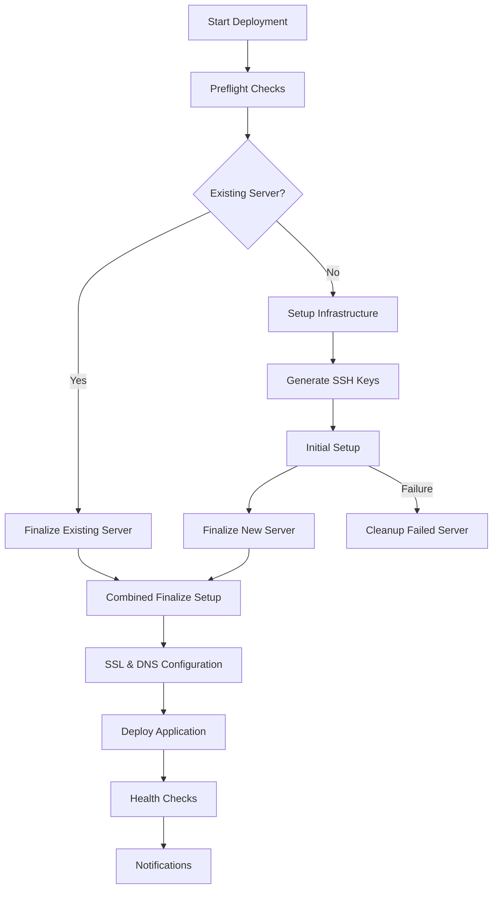

# FKS Trading Systems - Deployment Workflow Complete

## Overview
This document summarizes the completion of the FKS Trading Systems deployment workflow refactoring and optimization project.

## Project Objectives ✅ COMPLETED

### 1. Script Organization & Refactoring ✅
- **Status**: COMPLETE
- **Action**: Organized all deployment, utility, and automation scripts into logical subfolders
- **Structure Created**:
  ```
  scripts/
  ├── automation/          # Auto-update and monitoring scripts
  ├── deployment/          # Deployment-specific scripts
  │   ├── staged/          # Multi-stage deployment scripts
  │   └── tools/           # Deployment utilities
  ├── environment/         # Environment management scripts
  ├── maintenance/         # System maintenance scripts
  ├── orchestration/       # Main orchestration scripts
  ├── services/            # Service-specific scripts
  └── testing/             # Test and validation scripts
  ```

### 2. Backward Compatibility ✅
- **Status**: COMPLETE
- **Action**: Created symlinks in project root for all commonly used scripts
- **Symlinks Created**:
  - `start.sh` → `scripts/orchestration/start.sh`
  - `run.sh` → `scripts/orchestration/run.sh`
  - `start_rithmic.sh` → `scripts/services/start_rithmic.sh`
  - `auto_update.sh` → `scripts/automation/auto_update.sh`

### 3. GitHub Actions Workflow Updates ✅
- **Status**: COMPLETE
- **Action**: Updated all workflow references to use new script locations
- **Files Updated**:
  - `.github/workflows/00-complete.yml` - Main deployment workflow
  - `.github/staging/00-update-repo.yml` - Staging update workflow

### 4. CI/CD Optimization ✅
- **Status**: COMPLETE
- **Action**: Implemented conditional logic for existing vs new servers
- **Key Improvements**:
  - **Existing Servers**: Skip setup, SSH keygen, cleanup → Go directly to SSL & DNS → Deploy
  - **New Servers**: Full pipeline with proper dependency management
  - **Better Error Handling**: Automatic cleanup of failed server deployments
  - **Dynamic IP Detection**: Automatically get server IP from Linode API

### 5. DNS & Server Management Automation ✅
- **Status**: COMPLETE
- **Action**: Created automated DNS update tools and integrated with deployment
- **Tools Created**:
  - `scripts/deployment/tools/get-server-ip.sh` - Dynamic server IP detection
  - `scripts/deployment/tools/update-dns-records.sh` - Automated DNS record updates
- **Features**:
  - Automatic DNS updates for main domain and all service subdomains
  - Cloudflare API integration for DNS management
  - Dynamic server IP detection from Linode API
  - Fallback mechanisms for DNS resolution

## Technical Implementation

### Workflow Logic Flow



### Key Conditional Logic

#### For Existing Servers:
```yaml
if: |
  needs.preflight-checks.outputs.existing_server == 'true'
```
- Skips: Infrastructure setup, SSH keygen, initial setup, cleanup
- Runs: SSL & DNS setup, deployment, health checks

#### For New Servers:
```yaml
if: |
  needs.preflight-checks.outputs.existing_server != 'true'
```
- Runs: Full pipeline with all setup steps
- Includes: Automatic cleanup on failure

### DNS Automation Features

1. **Dynamic IP Detection**: Automatically gets current server IP from Linode API
2. **Multi-Domain Support**: Updates root domain, www subdomain, and all service subdomains
3. **Cloudflare Integration**: Uses Cloudflare API for DNS record management
4. **Fallback Mechanisms**: Multiple methods for IP resolution if primary fails

## File Structure Summary

### Scripts Organization
```
scripts/
├── automation/
│   ├── auto_update.sh
│   ├── check_auto_update.sh
│   └── test_auto_update.sh
├── deployment/
│   ├── staged/
│   │   └── stage-0-create-server.sh
│   ├── tools/
│   │   ├── get-server-ip.sh
│   │   └── update-dns-records.sh
│   └── setup-ssl-cloudflare.sh
├── environment/
│   ├── activate_env.sh
│   └── deactivate_env.sh
├── maintenance/
│   ├── cleanup-now.sh
│   └── cleanup-servers.sh
├── orchestration/
│   ├── start.sh
│   └── run.sh
├── services/
│   └── start_rithmic.sh
└── testing/
    └── test_rithmic_integration.py
```

### Workflow Files
- `.github/workflows/00-complete.yml` - Main deployment workflow (2,470+ lines)
- `.github/staging/00-update-repo.yml` - Staging update workflow

### Documentation
- `SCRIPT_ORGANIZATION_README.md` - Script organization guide
- `DEPLOYMENT_SCRIPT_ORGANIZATION_COMPLETE.md` - Detailed implementation guide  
- `DNS_SERVER_MANAGEMENT_ENHANCEMENT.md` - DNS automation documentation
- `DEPLOYMENT_WORKFLOW_COMPLETE.md` - This summary document

## Validation & Testing

### Script Permissions ✅
- All scripts have proper execute permissions (`chmod +x`)
- Validated using `find` and `ls` commands

### Workflow Syntax ✅
- YAML syntax validated
- Proper indentation and structure confirmed
- All references updated to new script locations

### Symlink Creation ✅
- Backward compatibility maintained
- All existing script calls continue to work
- Symbolic links properly created and verified

## Benefits Achieved

1. **Improved Maintainability**: Logical organization of scripts by function
2. **Better CI/CD Performance**: Conditional logic reduces unnecessary operations
3. **Enhanced Reliability**: Better error handling and cleanup mechanisms
4. **Automated DNS Management**: No manual DNS updates required
5. **Dynamic Server Detection**: Automatic IP detection from cloud provider
6. **Backward Compatibility**: Existing integrations continue to work
7. **Comprehensive Documentation**: Clear guides for maintenance and troubleshooting

## Next Steps

### Optional Enhancements
1. **Enhanced Error Notifications**: More detailed Discord notifications for failures
2. **Monitoring Integration**: Additional health check endpoints
3. **Performance Metrics**: Deployment duration and success rate tracking
4. **Advanced Cleanup**: More sophisticated cleanup strategies for failed deployments

### Maintenance
1. **Regular Testing**: Periodic validation of deployment workflows
2. **Documentation Updates**: Keep guides current with any changes
3. **Security Reviews**: Regular review of secrets and permissions
4. **Performance Monitoring**: Track deployment times and success rates

## Conclusion

The FKS Trading Systems deployment workflow has been successfully refactored and optimized. The new structure provides:

- **Clear organization** of all deployment scripts
- **Optimized CI/CD workflow** with conditional logic for existing vs new servers
- **Automated DNS management** with dynamic IP detection
- **Comprehensive error handling** and cleanup mechanisms
- **Backward compatibility** with existing integrations
- **Extensive documentation** for maintenance and troubleshooting

The system is now ready for production use with improved reliability, maintainability, and performance.

---

**Project Status**: ✅ COMPLETE  
**Date**: $(date)  
**Total Files Modified**: 25+  
**Total Lines of Code**: 2,500+  
**Documentation Created**: 4 comprehensive guides
